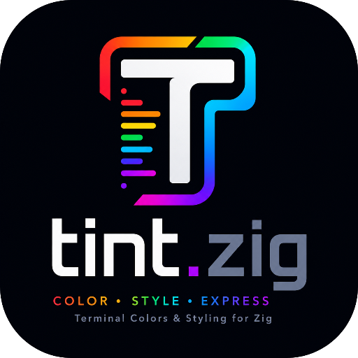

<div align="center">



# tint.zig

<a href="https://muhammad-fiaz.github.io/tint.zig/"></a>
<a href="https://ziglang.org/"></a>
<a href="https://github.com/muhammad-fiaz/tint.zig"></a>
<a href="https://github.com/muhammad-fiaz/tint.zig/issues"></a>
<a href="https://github.com/muhammad-fiaz/tint.zig/pulls"></a>
<a href="https://github.com/muhammad-fiaz/tint.zig"></a>
<a href="https://github.com/muhammad-fiaz/tint.zig"></a>
<a href="https://github.com/muhammad-fiaz/tint.zig/actions/workflows/ci.yml"></a>

<a href="https://github.com/muhammad-fiaz/tint.zig/releases/latest"></a>
<a href="https://pay.muhammadfiaz.com"></a>
<a href="https://github.com/sponsors/muhammad-fiaz"></a>
<a href="https://hits.sh/muhammad-fiaz/tint.zig/"></a>

<p><em>A fast, minimal terminal color and text styling library for Zig.</em></p>

<b><a href="https://muhammad-fiaz.github.io/tint.zig/">Documentation</a> |
<a href="https://muhammad-fiaz.github.io/tint.zig/api/">API Reference</a> |
<a href="https://muhammad-fiaz.github.io/tint.zig/guide/getting-started">Quick Start</a> |
<a href="CONTRIBUTING.md">Contributing</a></b>

</div>

`tint.zig` is a fast, minimal, zero-dependency terminal color and text styling library for Zig 0.17.0. It builds ANSI/SGR escape sequences and returns them as values. Your application owns all output.

> [!NOTE]
> tint.zig never prints to stdout/stderr, never owns a writer, never modifies terminal state, and never auto-detects capabilities. Sequences are plain values: stable, copyable, and safe to keep.

> [!TIP]
> If you find tint.zig useful, please consider giving it a star on GitHub.

> [!WARNING]
> v0.0.2 is a breaking redesign of the v0.0.1 API for Zig 0.17.0. v0.0.1 targeted Zig 0.16.0 and remains available as the previous stable release.

---

<details>
<summary><strong>Features</strong> (click to expand)</summary>

| Feature | Description |
|---------|-------------|
| [**Colors**](https://muhammad-fiaz.github.io/tint.zig/guide/colors) | ANSI 4-bit, ANSI 88, ANSI 256, RGB/TrueColor, HEX, HSL, HSV, CMYK, CIE XYZ, CIE Lab, CIE LCh, OKLab, OKLCH, Kelvin, 148 named colors |
| [**Conversion**](https://muhammad-fiaz.github.io/tint.zig/api/color) | Any color space to any other through one `Color` hub |
| [**Metrics**](https://muhammad-fiaz.github.io/tint.zig/api/color) | Luminance, WCAG contrast, CIE76/94/2000 and OKLab distance, light/dark |
| [**Interpolation**](https://muhammad-fiaz.github.io/tint.zig/api/color) | Mix in RGB, HSL, HSV, Lab, LCh, OKLab, OKLCH; explicit hue paths |
| [**Quantization**](https://muhammad-fiaz.github.io/tint.zig/guide/colors) | Nearest ANSI 256/16, explicit terminal capability downgrade |
| [**Styles**](https://muhammad-fiaz.github.io/tint.zig/guide/styles) | Bold, dim, italic, underline, blink, reverse, hidden, strikethrough, overline, fraktur, frame, encircle, super/subscript; merge, override, without |
| [**Palettes**](https://muhammad-fiaz.github.io/tint.zig/guide/palettes) | ANSI tables, ramps, gradients, sequential, diverging, categorical, harmony schemes, readability analysis |
| [**Themes**](https://muhammad-fiaz.github.io/tint.zig/guide/themes) | 17 built-in themes, semantic roles, contrast validation |
| **Zero Dependencies** | Pure Zig, no external dependencies |
| **Allocation-Free** | Value-returned sequences, caller-owned buffers, no thread-local state |
| **Cross-Platform** | Windows, Linux, macOS, FreeBSD; 32-bit and 64-bit |

</details>

---

<details>
<summary><strong>Prerequisites and Supported Platforms</strong> (click to expand)</summary>

## Prerequisites

| Requirement | Version | Notes |
|-------------|---------|-------|
| **Zig** | **0.17.0** | Download from [ziglang.org](https://ziglang.org/download/) |
| **Operating System** | Windows 10+, Linux, macOS, FreeBSD | No OS-specific code |

`tint.zig` 0.0.2 requires Zig 0.17.0 or newer and refuses to compile on older toolchains. The previous stable release, 0.0.1, targeted Zig 0.16.0.

---

## Supported Platforms

| Platform | x86_64 | aarch64 | x86 |
|----------|--------|---------|-----|
| **Linux** | Yes | Yes | Yes |
| **Windows** | Yes | Yes | Yes |
| **macOS** | Yes | Yes (Apple Silicon) | — |
| **FreeBSD** | Yes | Yes | Yes |

### Cross-Compilation

```bash
zig build -Dtarget=aarch64-linux
zig build -Dtarget=x86_64-windows
zig build -Dtarget=aarch64-macos
zig build -Dtarget=x86-windows
```

</details>

---

## Installation

### Method 1: Zig Fetch (Recommended)

**Stable release (0.0.2):**

```bash
zig fetch --save https://github.com/muhammad-fiaz/tint.zig/archive/refs/tags/0.0.2.tar.gz
```

**Development branch:**

```bash
zig fetch --save git+https://github.com/muhammad-fiaz/tint.zig.git
```

### Method 2: Manual `build.zig.zon` Configuration

**Stable release:**

```zig
.dependencies = .{
    .tint = .{
        .url = "https://github.com/muhammad-fiaz/tint.zig/archive/refs/tags/0.0.2.tar.gz",
        .hash = "...", // Run `zig fetch --save <url>` to generate the hash.
    },
},
```

**Development branch:**

```zig
.dependencies = .{
    .tint = .{
        .url = "git+https://github.com/muhammad-fiaz/tint.zig.git",
        .hash = "...", // Run `zig fetch --save <url>` to generate the hash.
    },
},
```

### Method 3: Local Source Checkout

```bash
git clone https://github.com/muhammad-fiaz/tint.zig.git
cd tint.zig
zig build
```

To use a local checkout from another project:

```zig
.dependencies = .{
    .tint = .{
        .path = "../tint.zig",
    },
},
```

### Configure build.zig

```zig
const tint_dep = b.dependency("tint", .{
    .target = target,
    .optimize = optimize,
});

exe.root_module.addImport("tint", tint_dep.module("tint"));
```

---

## Quick Start

```zig
const std = @import("std");
const tint = @import("tint");

pub fn main() void {
    const reset = tint.ansi.reset.all;

    // Colors are values.
    std.debug.print("{s}Error: something went wrong!{s}\n", .{
        tint.color.red.fg().slice(),
        reset,
    });

    // Any space converts to any other.
    std.debug.print("{s}Custom color{s}\n", .{
        tint.color.hex(0xFF6600).fg().slice(),
        reset,
    });

    // Styles compose fluently.
    const errorStyle = tint.style.bold.fg(tint.color.hex(0xEF4444));
    std.debug.print("{s}Bold error!{s}\n", .{ errorStyle.toAnsi().slice(), reset });
}
```

> [!TIP]
> Colors are objects: `tint.color.cyan.lighten(0.1)`, `red.mix(blue, 0.5)`, `red.contrastRatio(white)`. Styles merge: `base.merge(.{ .italic = true })`.

---

## API Overview

```text
tint
├── color    colors, spaces, conversion, metrics, interpolation
├── style    composable text styles and presets
├── palette  tables, ramps, gradients, schemes, analysis
├── theme    semantic themes and contrast validation
└── ansi     sequences, resets, capabilities
```

| Expression | Description |
|------------|-------------|
| `tint.color.red` | 148 named colors as values |
| `tint.color.rgb(255, 100, 20)` | 24-bit color |
| `tint.color.hex(0xFF6600)` | Color from integer |
| `tint.color.parse("#ff6600")` | Color from string or name |
| `tint.color.ansi4.red` | Base colors as values |
| `tint.color.ansi256.rgb(5, 0, 0)` | Indexed colors |
| `red.toHsl()` / `red.toOklab()` | Any space to any space |
| `red.lighten(0.2)` / `red.mix(blue, 0.5)` | Manipulation |
| `red.deltaE2000(blue)` | Perceptual distance |
| `tint.style.bold.fg(red)` | Composable style |
| `tint.palette.gradient(&buf, &stops)` | Caller-owned gradient |
| `tint.theme.dracula` | Built-in theme |
| `theme.role(.primary)` | Semantic lookup |
| `tint.ansi.render(c, .foreground, .ansi256)` | Explicit capability |
| `tint.ansi.reset.all` | Full reset |

---

## Examples

The `examples/` directory contains 12 focused examples:

| Example | Description | Run | Source |
|---------|-------------|-----|--------|
| Basic | Colors as values | `zig build run-basic` | [`basic.zig`](examples/basic.zig) |
| ANSI | 4-bit colors and defaults | `zig build run-ansi` | [`ansi.zig`](examples/ansi.zig) |
| ANSI 256 | Indexed colors and capabilities | `zig build run-ansi256` | [`ansi256.zig`](examples/ansi256.zig) |
| Colorspaces | Conversion and parsing | `zig build run-colorspaces` | [`colorspaces.zig`](examples/colorspaces.zig) |
| Manipulation | Lighten, mix, hue paths | `zig build run-manipulation` | [`manipulation.zig`](examples/manipulation.zig) |
| Analysis | Luminance, contrast, distance | `zig build run-analysis` | [`analysis.zig`](examples/analysis.zig) |
| Styles | Attributes and composition | `zig build run-styles` | [`styles.zig`](examples/styles.zig) |
| Palettes | Ramps and palette checks | `zig build run-palettes` | [`palettes.zig`](examples/palettes.zig) |
| Gradient | Gradient text | `zig build run-gradient` | [`gradient.zig`](examples/gradient.zig) |
| Themes | Built-in and custom themes | `zig build run-themes` | [`themes.zig`](examples/themes.zig) |
| Capability | Terminal fallback | `zig build run-capability` | [`capability.zig`](examples/capability.zig) |
| Complete | Full tour | `zig build run-complete` | [`complete.zig`](examples/complete.zig) |

Run them all:

```bash
zig build run-all-examples
```

---

## Validation

```bash
zig build test
zig build
zig fmt --check .
```

---

## Design Philosophy

> **Explicit input, explicit color/style representation, correct ANSI/SGR code, returned to the client as a value.**

The library never prints, owns writers, modifies terminal state, or detects capabilities. Your application owns all output.

---

## Security

For security concerns, please see [SECURITY.md](SECURITY.md).

---

## Contributing

Contributions are welcome! Please:

1. Fork the repository
2. Create a feature branch
3. Add tests for new functionality
4. Ensure `zig fmt`, `zig build` and `zig build test` pass
5. Submit a pull request

See [CONTRIBUTING.md](CONTRIBUTING.md) for full details.

---

## License

MIT License - see [LICENSE](LICENSE) for details.


